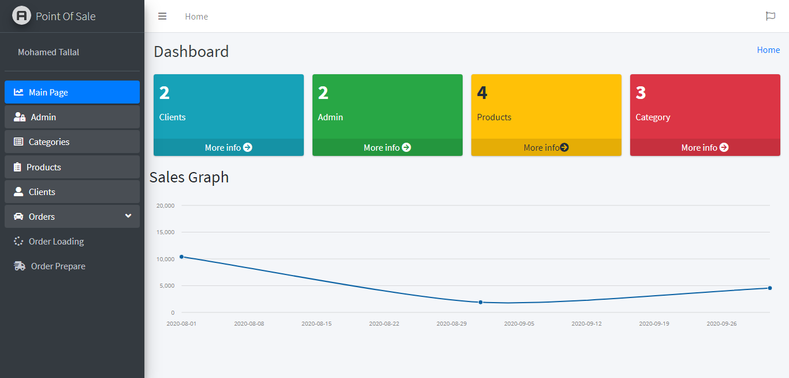

## App Features

Point Of Sales is an electronic cash register which saves valuable time and energy of both customer and the workers and provides systematic transaction process for the goods purchased by the customers.

- Multi language (English and Arabic).
- View sales reports .
- Can add new admin , give permission to admin , update admin information and delete it .
- Can add new Category , update Category information and delete it 
- Can add new Product , update Product information and delete it 
- Print Invoices

### Install Project

- Download the project.
- composer install (run this command line in cmd ).
- copy .env.example and rename it to .env 
- php artisan key:generate (run this command line in cmd ).
- add database name in .env file
- php artisan migrate (run this command line in cmd ).
- php artisan db:seed (run this command line in cmd ).

